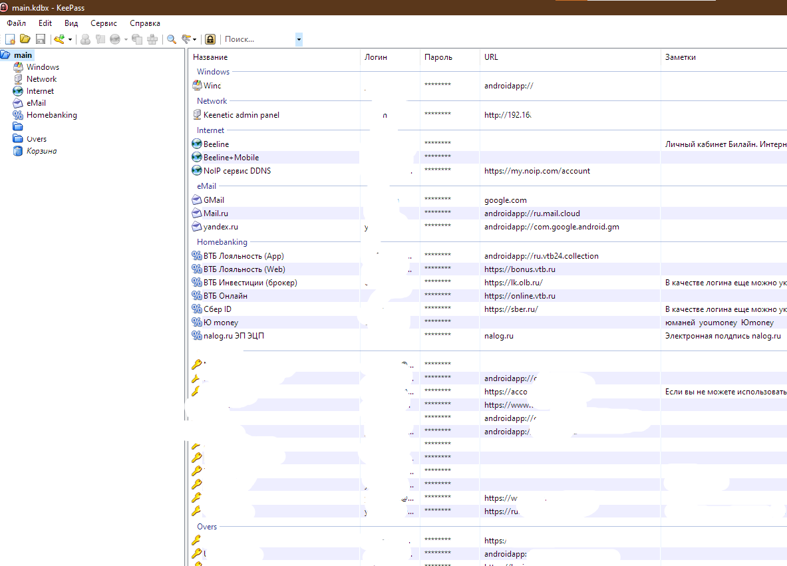
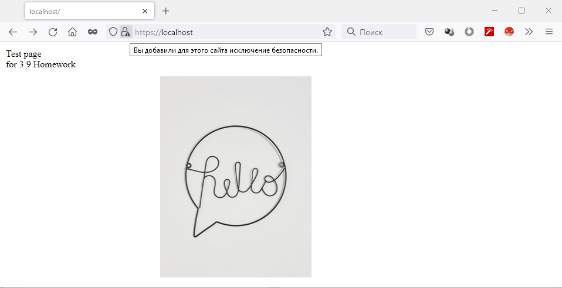

# 3.9. Элементы безопасности информационных систем

1. Установите Bitwarden плагин для браузера. Зарегистрируйтесь и сохраните несколько паролей.

И дома и на работе использую keepass. При этом дома настроена репликация на частное облако и на android стоит соответсвующий клиент, что обеспечивает "единую" парольную базу.
На работе же используем с коллегами вариант репликации на триггерах через общую smb-шару, доступную по доменным у.з.


2. Установите Google authenticator на мобильный телефон. Настройте вход в Bitwarden аккаунт через Google authenticator OTP.

Установлен, но не хотелось бы приводить скриншот.
В рамках самостоятельного изучения открыл для себя, что существует соответствующий плагин для Keepass [KeePassOTP](https://github.com/Rookiestyle/KeePassOTP)
Попробую на выходных может на тестовой копии.

3. Установите apache2, сгенерируйте самоподписанный сертификат, настройте тестовый сайт для работы по HTTPS.

Разрешено было устанавливать nginx


4. Проверьте на TLS уязвимости произвольный сайт в интернете (кроме сайтов МВД, ФСБ, МинОбр, НацБанк, РосКосмос, РосАтом, РосНАНО и любых госкомпаний, объектов КИИ, ВПК ... и тому подобное).

Ответ ввиду большого листинга поместил в [testssl.md](./testssl.md)

5. Установите на Ubuntu ssh сервер, сгенерируйте новый приватный ключ. Скопируйте свой публичный ключ на другой сервер. Подключитесь к серверу по SSH-ключу.

```bash
vagrant@vagrant:~$ ssh-keygen
Generating public/private rsa key pair.
Enter file in which to save the key (/home/vagrant/.ssh/id_rsa):
Enter passphrase (empty for no passphrase):
Enter same passphrase again:
Your identification has been saved in /home/vagrant/.ssh/id_rsa
Your public key has been saved in /home/vagrant/.ssh/id_rsa.pub
The key fingerprint is:
SHA256:IAUORTYRWDa2pnfd4S1SmjdVpKTe1vU2pHJ8nH//G6s vagrant@vagrant
The key's randomart image is:
+---[RSA 3072]----+
|  .=&+.     ..o  |
|  .* =     o o   |
|    = .   + o  ..|
|   o . o B =..+.o|
|  . . . S B.++.=o|
|   . .   o +o ..o|
|               .o|
|                =|
|             E.o=|
+----[SHA256]-----+
vagrant@vagrant:~$ ssh-copy-id vagrant@10.0.2.15
/usr/bin/ssh-copy-id: INFO: Source of key(s) to be installed: "/home/vagrant/.ssh/id_rsa.pub"
The authenticity of host '10.0.2.15 (10.0.2.15)' can't be established.
ECDSA key fingerprint is SHA256:RztZ38lZsUpiN3mQrXHa6qtsUgsttBXWJibL2nAiwdQ.
Are you sure you want to continue connecting (yes/no/[fingerprint])? yes
/usr/bin/ssh-copy-id: INFO: attempting to log in with the new key(s), to filter out any that are already installed
/usr/bin/ssh-copy-id: INFO: 1 key(s) remain to be installed -- if you are prompted now it is to install the new keys
vagrant@10.0.2.15's password:

Number of key(s) added: 1

Now try logging into the machine, with:   "ssh 'vagrant@10.0.2.15'"
and check to make sure that only the key(s) you wanted were added.
```

6. Переименуйте файлы ключей из задания 5. Настройте файл конфигурации SSH клиента, так чтобы вход на удаленный сервер осуществлялся по имени сервера.

```bash
vagrant@vagrant:~$ cp .ssh/id_rsa{,_new}
vagrant@vagrant:~$ cp .ssh/id_rsa{,_new}.pub
vagrant@vagrant:~$ touch ~/.ssh/config && chmod 600 ~/.ssh/config
vagrant@vagrant:~$ cat .ssh/config
Host 10.0.2.15
        User vagrant
        Port 22
        IdentityFile ~/.ssh/id_rsa_new
Host *
        IdentityFile ~/.ssh/id_rsa
```

7. Соберите дамп трафика утилитой tcpdump в формате pcap, 100 пакетов. Откройте файл pcap в Wireshark.

```bash
vagrant@vagrant:~$ sudo tcpdump -w dump.pcap -c 100
tcpdump: listening on eth0, link-type EN10MB (Ethernet), capture size 262144 bytes
100 packets captured
135 packets received by filter
0 packets dropped by kernel
```

 ---
## Задание для самостоятельной отработки (необязательно к выполнению)

8*. Просканируйте хост scanme.nmap.org. Какие сервисы запущены?

```bash
vagrant@vagrant:~$ sudo nmap -T5 -Pn -O -sS scanme.nmap.org
Starting Nmap 7.80 ( https://nmap.org ) at 2022-01-14 00:58 MSK
Warning: 45.33.32.156 giving up on port because retransmission cap hit (2).
Nmap scan report for scanme.nmap.org (45.33.32.156)
Host is up (0.11s latency).
Other addresses for scanme.nmap.org (not scanned): 2600:3c01::f03c:91ff:fe18:bb2f
Not shown: 919 closed ports, 76 filtered ports
PORT      STATE SERVICE
22/tcp    open  ssh
53/tcp    open  domain
80/tcp    open  http
9929/tcp  open  nping-echo
31337/tcp open  Elite
Device type: bridge|general purpose
Running (JUST GUESSING): Oracle Virtualbox (97%), QEMU (91%)
OS CPE: cpe:/o:oracle:virtualbox cpe:/a:qemu:qemu
Aggressive OS guesses: Oracle Virtualbox (97%), QEMU user mode network gateway (91%)
No exact OS matches for host (test conditions non-ideal).

OS detection performed. Please report any incorrect results at https://nmap.org/submit/ .
Nmap done: 1 IP address (1 host up) scanned in 33.72 seconds
```

9*. Установите и настройте фаервол ufw на web-сервер из задания 3. Откройте доступ снаружи только к портам 22,80,443

```bash
vagrant@vagrant:~$ sudo ufw app list
Available applications:
  Nginx Full
  Nginx HTTP
  Nginx HTTPS
  OpenSSH
vagrant@vagrant:~$ sudo ufw allow 'Nginx Full'
Rules updated
Rules updated (v6)
vagrant@vagrant:~$ sudo ufw allow 'OpenSSH'
Rules updated
Rules updated (v6)
vagrant@vagrant:~$ sudo ufw enable
Command may disrupt existing ssh connections. Proceed with operation (y|n)? y
Firewall is active and enabled on system startup
vagrant@vagrant:~$ sudo ufw status verbose
Status: active
Logging: on (low)
Default: deny (incoming), allow (outgoing), disabled (routed)
New profiles: skip

To                         Action      From
--                         ------      ----
80,443/tcp (Nginx Full)    ALLOW IN    Anywhere
22/tcp (OpenSSH)           ALLOW IN    Anywhere
80,443/tcp (Nginx Full (v6)) ALLOW IN    Anywhere (v6)
22/tcp (OpenSSH (v6))      ALLOW IN    Anywhere (v6)
```
