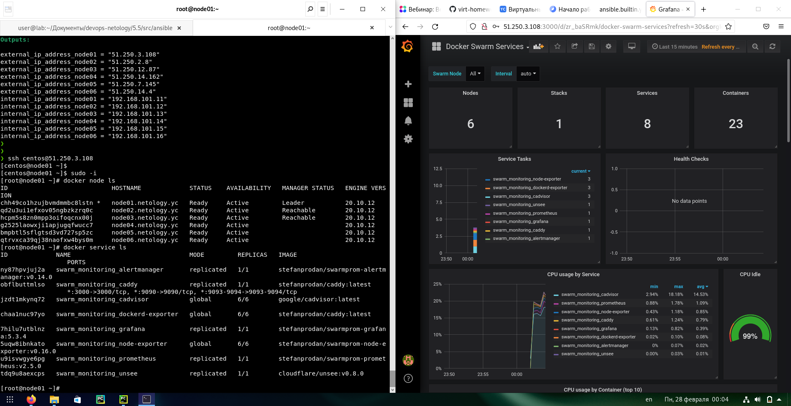

# 5.5. Оркестрация кластером Docker контейнеров на примере Docker Swarm

## Задача 1

Дайте письменые ответы на следующие вопросы:

- В чём отличие режимов работы сервисов в Docker Swarm кластере: replication и global?  
Ответ: при выборе global - сервис будет запущен на всех нодах, при replication - необходимо задавать параметр с количеством реплик.
- Какой алгоритм выбора лидера используется в Docker Swarm кластере?  
Ответ: [Raft](https://ru.wikipedia.org/wiki/%D0%90%D0%BB%D0%B3%D0%BE%D1%80%D0%B8%D1%82%D0%BC_Raft) - алгоритм поддержания распределенного консенсуса.
- Что такое Overlay Network?  
Ответ: это логическая (виртуальная) сеть, создаваемая поверх имеющихся каналов связи. Механизм Docker Swarm использует их, чтобы инкапсулировать L2 в L4, давая возможность сервисам работать в "одной" подсети.

## Задача 2

Создать ваш первый Docker Swarm кластер в Яндекс.Облаке

Для получения зачета, вам необходимо предоставить скриншот из терминала (консоли), с выводом команды:
```
docker node ls
```

## Задача 3

Создать ваш первый, готовый к боевой эксплуатации кластер мониторинга, состоящий из стека микросервисов.

Для получения зачета, вам необходимо предоставить скриншот из терминала (консоли), с выводом команды:
```
docker service ls
```

Ответ на задачи 2-3  


## Задача 4 (*)

Выполнить на лидере Docker Swarm кластера команду (указанную ниже) и дать письменное описание её функционала, что она делает и зачем она нужна:
```
# см.документацию: https://docs.docker.com/engine/swarm/swarm_manager_locking/
docker swarm update --autolock=true
```

