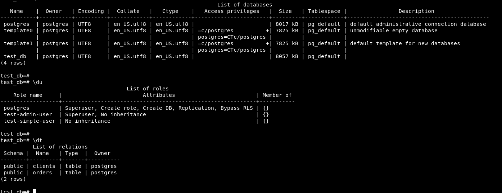
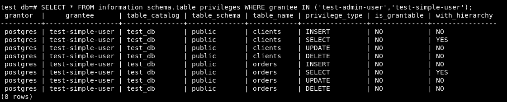
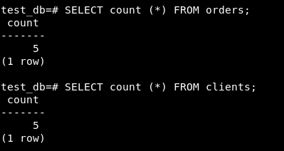
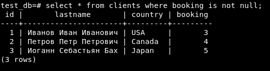
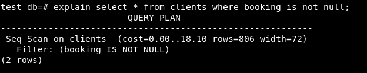
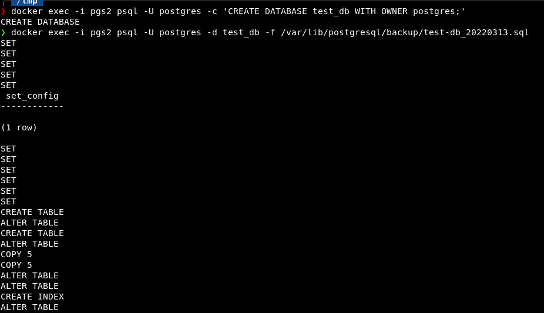

# 6.2. SQL

## Введение

Перед выполнением задания вы можете ознакомиться с 
[дополнительными материалами](https://github.com/netology-code/virt-homeworks/tree/master/additional/README.md).

## Задача 1

Используя docker поднимите инстанс PostgreSQL (версию 12) c 2 volume, 
в который будут складываться данные БД и бэкапы.

Приведите получившуюся команду или docker-compose манифест.

```bash
docker pull postgres:12
docker volume create pgs-vol1
docker volume create pgs-vol2
docker run --rm --name pgs -e POSTGRES_PASSWORD=postgres -ti -p 5432:5432 -v pgs-vol1:/var/lib/postgresql/data -v pgs-vol2:/var/lib/postgresql/backup postgres:12
```

## Задача 2

В БД из задачи 1: 
- создайте пользователя test-admin-user и БД test_db
- в БД test_db создайте таблицу orders и clients (спeцификация таблиц ниже)
- предоставьте привилегии на все операции пользователю test-admin-user на таблицы БД test_db
- создайте пользователя test-simple-user  
- предоставьте пользователю test-simple-user права на SELECT/INSERT/UPDATE/DELETE данных таблиц БД test_db

Таблица orders:
- id (serial primary key)
- наименование (string)
- цена (integer)

Таблица clients:
- id (serial primary key)
- фамилия (string)
- страна проживания (string, index)
- заказ (foreign key orders)

Приведите:
- итоговый список БД после выполнения пунктов выше,
- описание таблиц (describe)
- SQL-запрос для выдачи списка пользователей с правами над таблицами test_db
- список пользователей с правами над таблицами test_db

Ответ:  
Для удобства работы установил (по совету друга) [DBeaver](https://dbeaver.io).
Подключился к экземпляру БД по проброшенному на localhost порту.  
```sql
CREATE DATABASE test_db;
-- После этого переподключился к СУБД с использованием новосозданной БД.

CREATE TABLE orders 
(
	id integer, 
	name text, 
	price integer, 
	PRIMARY KEY (id) 
);

CREATE TABLE clients 
(
	id integer PRIMARY KEY,
	lastname text,
	country text,
	booking integer,
	FOREIGN KEY (booking) REFERENCES orders (Id)
);

CREATE INDEX on clients (country);

CREATE ROLE "test-admin-user" SUPERUSER NOCREATEDB NOCREATEROLE NOINHERIT LOGIN;
CREATE ROLE "test-simple-user" NOSUPERUSER NOCREATEDB NOCREATEROLE NOINHERIT LOGIN;

GRANT SELECT ON TABLE public.clients TO "test-simple-user";
GRANT INSERT ON TABLE public.clients TO "test-simple-user";
GRANT UPDATE ON TABLE public.clients TO "test-simple-user";
GRANT DELETE ON TABLE public.clients TO "test-simple-user";
GRANT SELECT ON TABLE public.orders TO "test-simple-user";
GRANT INSERT ON TABLE public.orders TO "test-simple-user";
GRANT UPDATE ON TABLE public.orders TO "test-simple-user";
GRANT DELETE ON TABLE public.orders TO "test-simple-user";
```



## Задача 3

Используя SQL синтаксис - наполните таблицы следующими тестовыми данными:

Таблица orders

|Наименование|цена|
|------------|----|
|Шоколад| 10 |
|Принтер| 3000 |
|Книга| 500 |
|Монитор| 7000|
|Гитара| 4000|

Таблица clients

|ФИО|Страна проживания|
|------------|----|
|Иванов Иван Иванович| USA |
|Петров Петр Петрович| Canada |
|Иоганн Себастьян Бах| Japan |
|Ронни Джеймс Дио| Russia|
|Ritchie Blackmore| Russia|

Используя SQL синтаксис:
- вычислите количество записей для каждой таблицы 
- приведите в ответе:
    - запросы 
    - результаты их выполнения.

Ответ:  
```sql
INSERT INTO orders VALUES 
	(1, 'Шоколад', 10), 
	(2, 'Принтер', 3000), 
	(3, 'Книга', 500), 
	(4, 'Монитор', 7000), 
	(5, 'Гитара', 4000);
INSERT INTO clients VALUES 
	(1, 'Иванов Иван Иванович', 'USA'), 
	(2, 'Петров Петр Петрович', 'Canada'), 
	(3, 'Иоганн Себастьян Бах', 'Japan'), 
	(4, 'Ронни Джеймс Дио', 'Russia'), 
	(5, 'Ritchie Blackmore', 'Russia');
SELECT count (*) FROM orders;
SELECT count (*) FROM clients;
```


## Задача 4

Часть пользователей из таблицы clients решили оформить заказы из таблицы orders.  
Используя foreign keys свяжите записи из таблиц, согласно таблице:

|ФИО|Заказ|
|------------|----|
|Иванов Иван Иванович| Книга |
|Петров Петр Петрович| Монитор |
|Иоганн Себастьян Бах| Гитара |

Приведите:
- SQL-запросы для выполнения данных операций.  
- SQL-запрос для выдачи всех пользователей, которые совершили заказ, а также вывод данного запроса.

Подсказка - используйте директиву `UPDATE`.

Ответ:  
```sql
UPDATE clients SET booking = 3 WHERE id = 1;
UPDATE clients SET booking = 4 WHERE id = 2;
UPDATE clients SET booking = 5 WHERE id = 3;
```


## Задача 5

Получите полную информацию по выполнению запроса выдачи всех пользователей из задачи 4 
(используя директиву EXPLAIN).  
Приведите получившийся результат и объясните что значат полученные значения.

  
Показывает стоимость (cost) запроса, а также фильтрацию по полю booking.

## Задача 6

Создайте бэкап БД test_db и поместите его в volume, предназначенный для бэкапов (см. Задачу 1).  
Остановите контейнер с PostgreSQL (но не удаляйте volumes).  
Поднимите новый пустой контейнер с PostgreSQL.  
Восстановите БД test_db в новом контейнере.  
Приведите список операций, который вы применяли для бэкапа данных и восстановления.

Ответ:  
```bash
docker exec -t pgs pg_dump -U postgres test_db -f /var/lib/postgresql/backup/test-db_20220313.sql
docker run --rm --name pgs2 -e POSTGRES_PASSWORD=postgres -ti -p 5432:5432 -v pgs2-vol1:/var/lib/postgresql/data -v pgs-vol2:/var/lib/postgresql/backup postgres:12
docker exec -i pgs2 psql -U postgres -c 'CREATE DATABASE test_db WITH OWNER postgres;'
docker exec -i pgs2 psql -U postgres -d test_db -f /var/lib/postgresql/backup/test-db_20220313.sql
```
