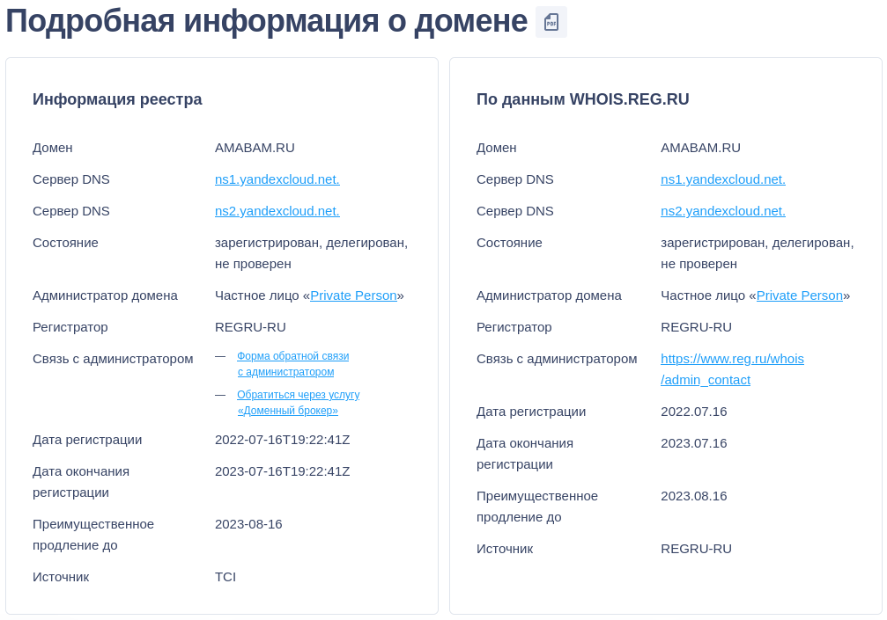
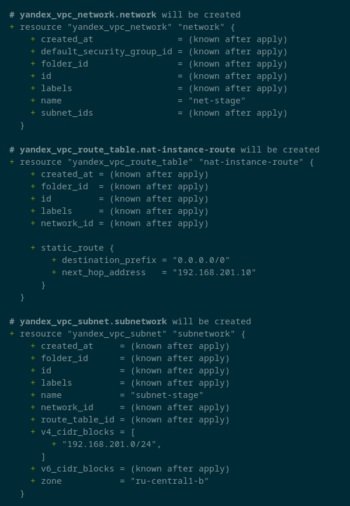
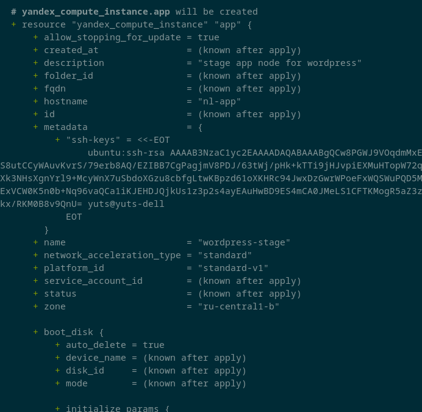
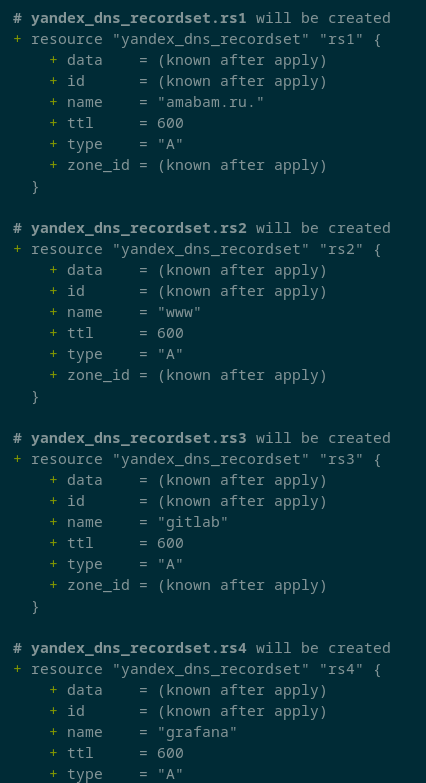
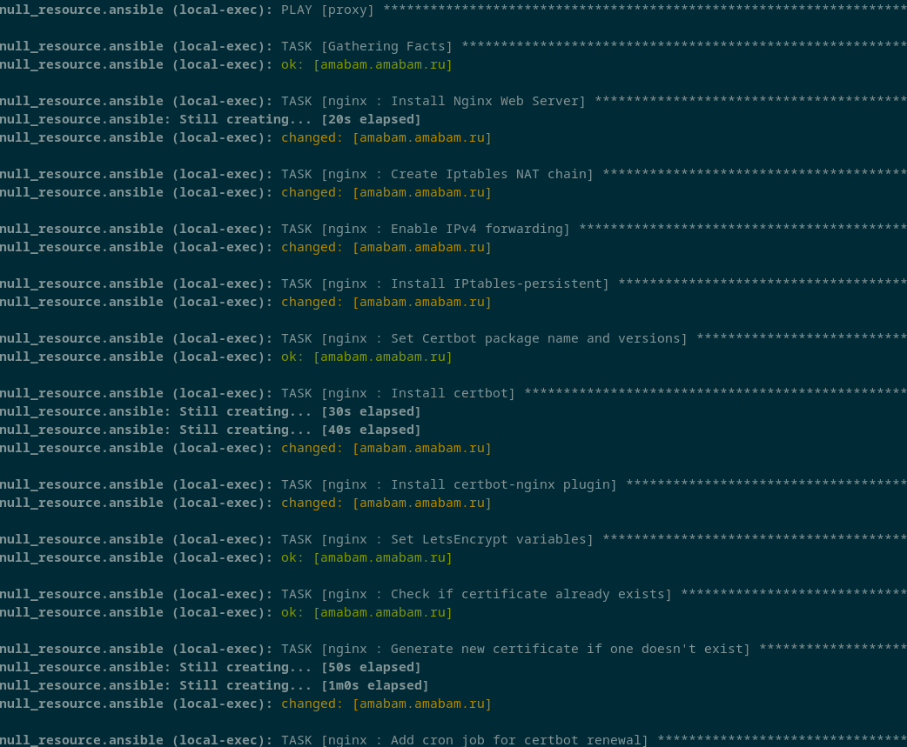
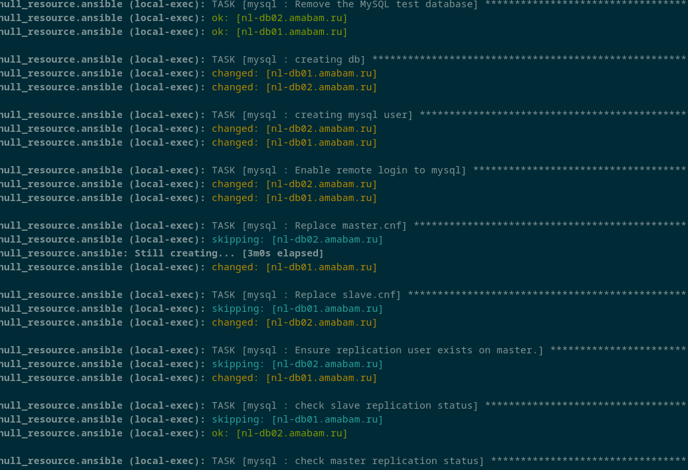
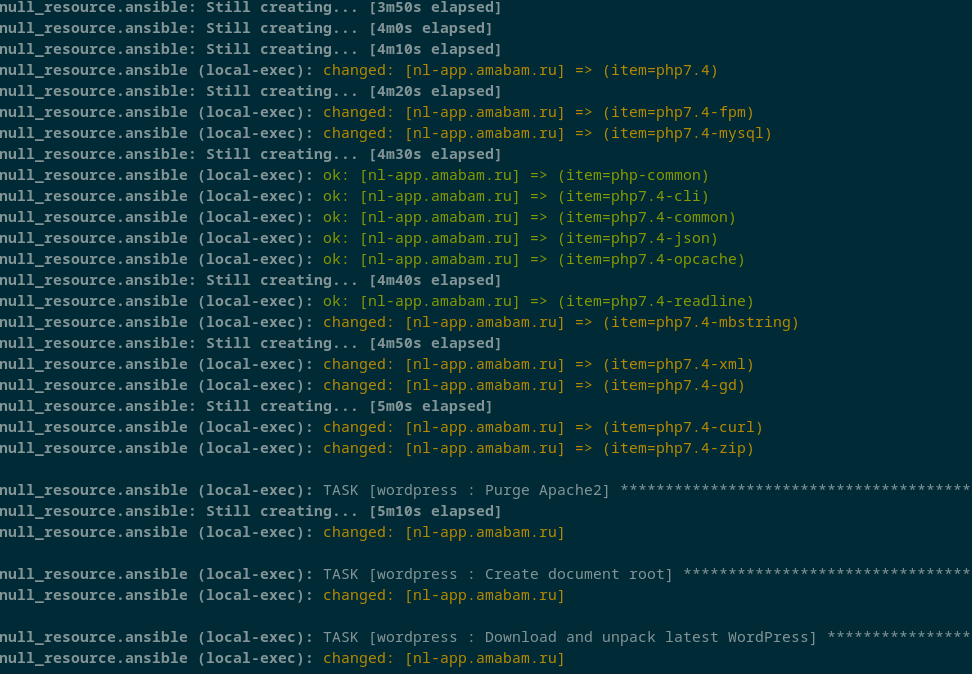
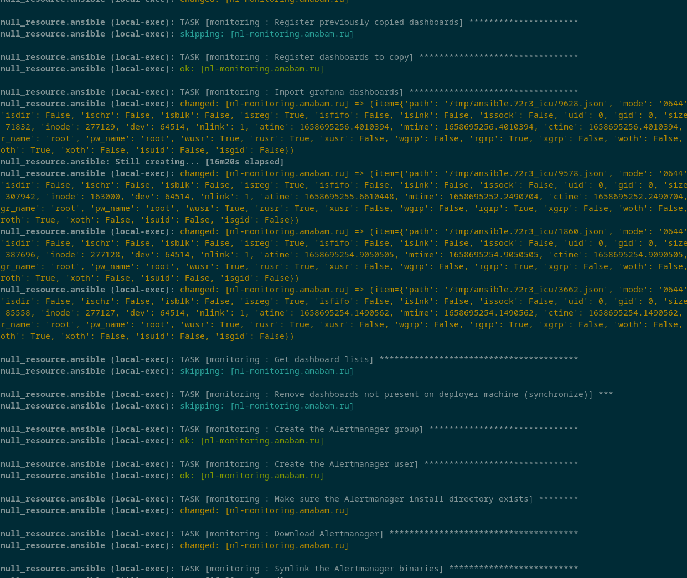
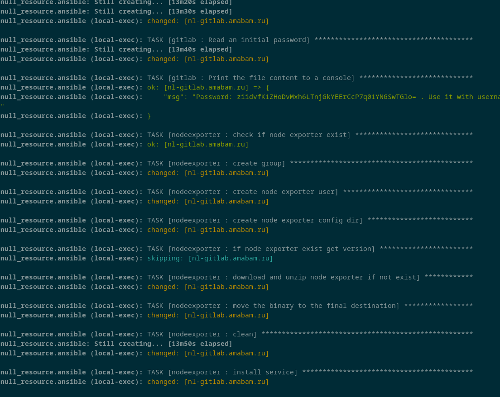
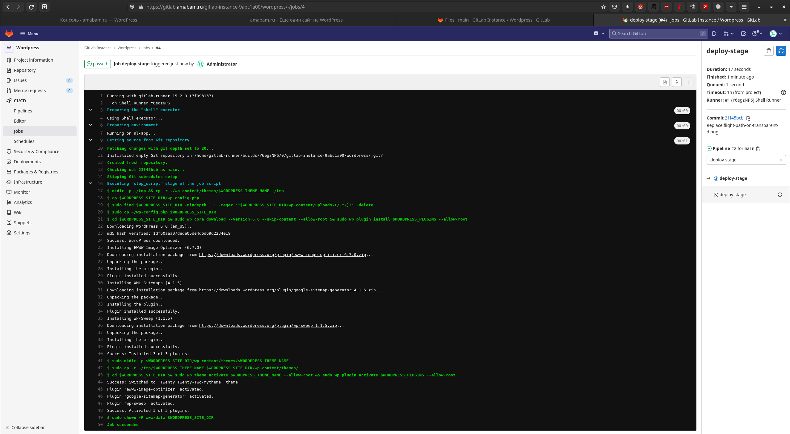

# Дипломное задание по курсу «DevOps-инженер»

## Список задач диплома
1. Зарегистрировать доменное имя (любое на ваш выбор в любой доменной зоне).
2. Подготовить инфраструктуру с помощью Terraform на базе облачного провайдера YandexCloud.
3. Настроить внешний Reverse Proxy на основе Nginx и LetsEncrypt.
4. Настроить кластер MySQL.
5. Установить WordPress.
6. Развернуть Gitlab CE и Gitlab Runner.
7. Настроить CI/CD для автоматического развёртывания приложения.
8. Настроить мониторинг инфраструктуры с помощью стека: Prometheus, Alert Manager и Grafana.

## Цели
1. Применить на практике полученные навыки и знания
2. Повсеместно применять IaaC подход при организации (эксплуатации) инфраструктуры
3. Получить работающую инфраструктуру с возможностью её быстрого воспроизведения посредством terraform/ansible

## Подготовительный этап на рабочей станции
_Здесь и далее команды приведены с моей хостовой машины пож управлением Manjaro_
1. Установка terraform
`sudo pacman -Sy terraform`
2. Первичная конфигурация terraform
Для выполнения задач дипломной работы были созданы два workspace:
```bash
terraform workspace list
  default
  prod
* stage
```
3. Уставнока ansible
`sudo pacman -Sy ansible`
4. Установка Yandex Cloud CLI
`curl -sSL https://storage.yandexcloud.net/yandexcloud-yc/install.sh | zsh`
5. Конфигурация Yandex Cloud CLI
Перейти на [https://oauth.yandex.ru/](https://oauth.yandex.ru/authorize?response_type=token&client_id=1a6990aa636648e9b2ef855fa7bec2fb)  
Скопировать и сохранить токен.  
Выполнить команду `yc init` и, следуя инструкциям, завершить настройку.  
Далее, в [веб-интерфейсе](https://console.cloud.yandex.ru/) создать сервисный аккаунт с назначенными правами editor.  
Выгрузить ключ сервисного аккаунта:  
`yc iam key create --service-account-name terraform --output key.json`

При выполнении данного этапа использовалась официальная документация YC: https://cloud.yandex.ru/docs/cli/quickstart

## Регистрация доменного имени
В связи с непонятной обстановкой относительно международных доменов было решено в рамках диплома использовать домен в зоне .ru  
В [reg.ru](reg.ru) был приобретён домен **amabam.ru**.  
Также он был сделегирован на ns1.yandexcloud.net и ns2.yandexcloud.net, что позволит впоследствии автоматизировать создание ресурсных записей в зоне.  
   

## Подготовка инфраструктуры
В рамках концепции IaaC создание инфраструктуры проекта полностью отдано terraform.  
Вся конфигурация расположена в [./terraform](./terraform).  

Задачи решаемые данным модулем:
1. Создание сети и подсети (меняются в зависимости от используемого окружения terraform)  
 - [./terraform/network.tf](./terraform/network.tf)  
На этом этапе также создаётся машрут по-умолчанию, указывающий на внутренний адрес машины с прокси.  
ВМ, не имеющие белого IP, будут обращаться к внешним ресурсам, прогоняя траффик через неё.  

2. Создание Compute instance в соотвествии с задачами диплома:  
 - [./terraform/proxy.tf](./terraform/proxy.tf) - реверс-прокси на nginx  
 - [./terraform/mysql.tf](./terraform/mysql.tf) - БД 
 - [./terraform/app.tf](./terraform/app.tf) - wordpress  
 - [./terraform/git.tf](./terraform/git.tf) - gitlab  
 - [./terraform/monitoring.tf](./terraform/monitoring.tf) - стек мониторинга  

4. Создаётся публичная зона в Cloud DNS и необходимые A-записи в ней  
 - [./terraform/dns.tf](./terraform/dns.tf)

5. Генерируются файлы, которые впоследствии будут использоваться ansible
 - inventory.tf  
 - hosts.tf  
5. Вызывается провижн ansible:  
 - ansible.tf  

Полный вывод `terraform plan`: приведён в [scrns/terraform_plan.log](scrns/terraform_plan.log).
При выполнении данного этапа использовалась официальная документация:
 - YC https://cloud.yandex.ru/docs/
 - Terraform https://www.terraform.io/docs

## Установка и конфигурация ПО
Вся конфигурация осуществляется с применением ansible-provision.  
Плейбуки расположены в [./ansible](./ansible).  
[./ansible/play.yml](./ansible/play.yml) применится на [./ansible/inventory.yml](./ansible/inventory.yml), ранее сгенерированный Terraform.

### Установка Nginx и LetsEncrypt
Цель: Создать reverse proxy с поддержкой TLS для обеспечения безопасного доступа к веб-сервисам по HTTPS
Данная задача решается выполнением на группу хостов `proxy` задач описанных в роли [nginx](./ansible/roles/nginx).
В результате выполнения:
 - создаётся конфигурационный файл, описывающий upstream до всех внутренних сервисов
 - добавляется таблица nat в iptables и разрешение ipv4 forwarding для прохождения трафика извне наружу (для ВМ без белого IP)
 - устанавливается и запускается certbot для автоматизации выпуска сертификатов от LetsEncrypt.  
Причём при использовании stage окружения terraform - сертификаты будут использоваться также stage (не тратящие лимит на домен)  

### Установка кластера MySQL
Цель: Получить отказоустойчивый кластер баз данных MySQL
Данная задача решается выполнением на группу хостов `db` задач описанных в роли [mysql](./ansible/roles/mysql).  
В результате выполнения на двух ВМ будет проинсталлирован MySQL.  
Мастером при конфигурации репликации выбирается первый хост.  

### Установка WordPress
Цель: Установить Wordpress, использующий базу, созданную на предыдущем шаге.
Данная задача решается выполнением на группу хостов `app` задач описанных в роли [wordpress](./ansible/roles/wordpress).  
В результате выполнения на ВМ будет установлен:
 - nginx в качестве веб-сервера
 - wordpress (https://wordpress.org/latest.tar.gz)  

### Установка Prometheus, Alert Manager, Node Exporter и Grafana
Цель: Необходимо разработать Ansible роль для установки Prometheus, Alert Manager и Grafana.  
Данная задача решается выполнением на группу хостов `monitoring` задач описанных в роли [monitoring](./ansible/roles/monitoring).  
В результате выполнения на ВМ будут:
 - установлен Prometheus и нацелен на список таргетов. Связан с Alertmanager.  
 - установлен Alertmanager и создан набор правил алертинга.  
 - установлена Grafana и создан набор дашбордов.  
Также на всех ВМ устанавливается nodeexporter в рамках общего [./ansible/play.yml](./ansible/play.yml).  

### Установка Gitlab CE и Gitlab Runner
Цель: Необходимо настроить CI/CD систему для автоматического развертывания приложения (сайт на wordpress) при изменении кода.  
Данную задачу не удалось выполнить в рамках единого выполнения ansible-provision при выполнении набора инструкций terraform.  
Она была разделена мной на два этапа:  
 - Установка Gitlab CE: решается выполнением на группу хостов `git` задач описанных в роли [gitlab](./ansible/roles/gitlab)  
В следствии выполнения на ВМ будут добавлены репозитории и установлен Gitlab CE.
 - Настройка Gitlab CI/CD с использовнием Gitlab Runner  
Конфигурация в [./git-conf/](./git-conf/)  
Перед использованием необходимо подготовить репозиторий и gitlab-runner:
1. Зайти в локальный gitlab.  
2. Создать новый публичный репозиторий.  
3. Скопировать в этот репозиторий файлы из каталога [git-conf](../git-conf)
4. В настройках найти и скопировать токен доступа (Settings-CI/CD-Runners), вписать его в переменную `runner_token` в файле [./ansible/group_vars/app.yml](./ansible/group_vars/app.yml)
5. Для запуска пайплайнов необходимо подготовить ВМ с Wordpress, развернув на ней gitlab-runner и wp-cli:  
```bash
$ cd ansible
$ ansible-playbook -i inventory.yml -l app ../git-conf/prepare.yml 
```  


При выполнении этого этапа постоянно использовались следующие ресурсы:
 - https://docs.ansible.com/ansible/latest/
 - https://galaxy.ansible.com/search
 - https://github.com/wp-cli/wp-cli
 - https://grafana.com/docs/
 - https://prometheus.io/docs/visualization/grafana/

### Доставка изменений приложения (сайт на Wordpress)
Цель: Исключить ручной труд при доставке изменений в содержимом сайта.  
Для достижения данной цели был настроен процесс Gitlab CI с одним активным gitlab-runner, развёрнутым на ВМ с wordpress.  
При обновлении репозитория запускается задача pipeline.  
Runner загрузит обновления wordpress плагинов, а также изменения, произведённые в репозитории.  
Используя [Wordpress CLI](https://wp-cli.org/) активирует обновлённые плагины и тему сайта.  


При выполнении этого этапа постоянно использовались следующие ресурсы:
 - https://wp-cli.org/
 - https://www.dmosk.ru/miniinstruktions.php?mini=gitlab-runner-web
 - https://habr.com/en/post/498436/

## Скриншоты работы систем
### Мониторинг
#### Grafana
  
#### Prometheus
  
#### Alertmanager
  
### Gitlab
Общий вид репозитория под WP:  
  
Работа pipeline:  
  
### Wordpress (до и после отработки pipeline)
  
  
После изменения картинки и отработки pipeline:
  

## Выводы
В результате выполнения дипломной работы были закреплены навыки, приобретенные при обучении.  
Получен обширный опыт работы в рамках подхода IaaC.


_Студент: Дмитрий Ю._
