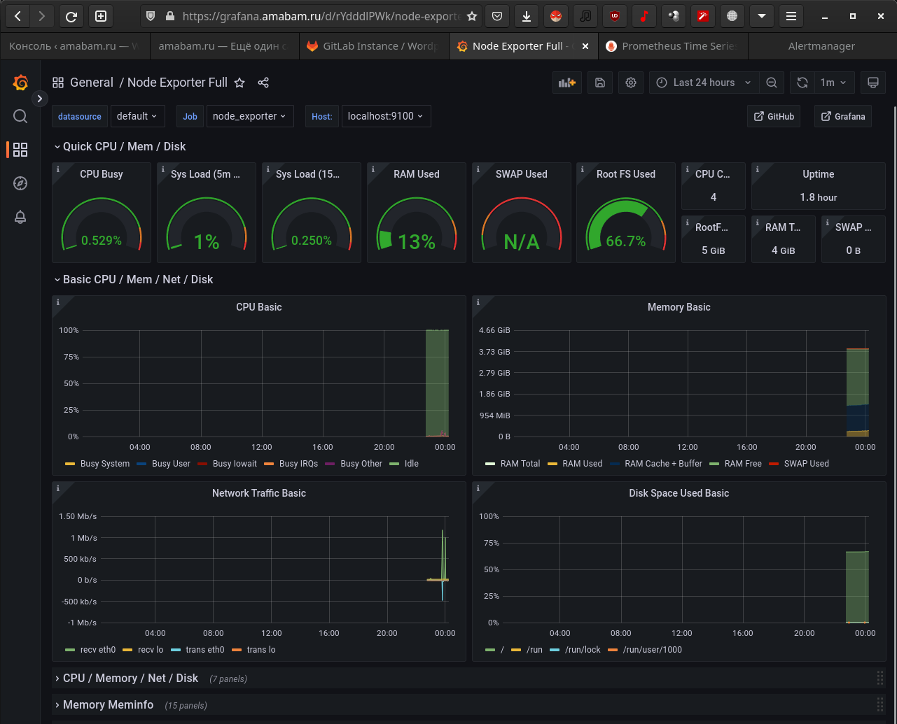
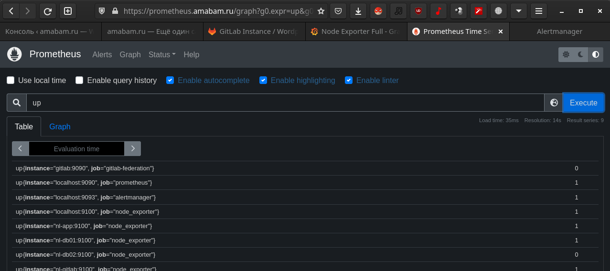
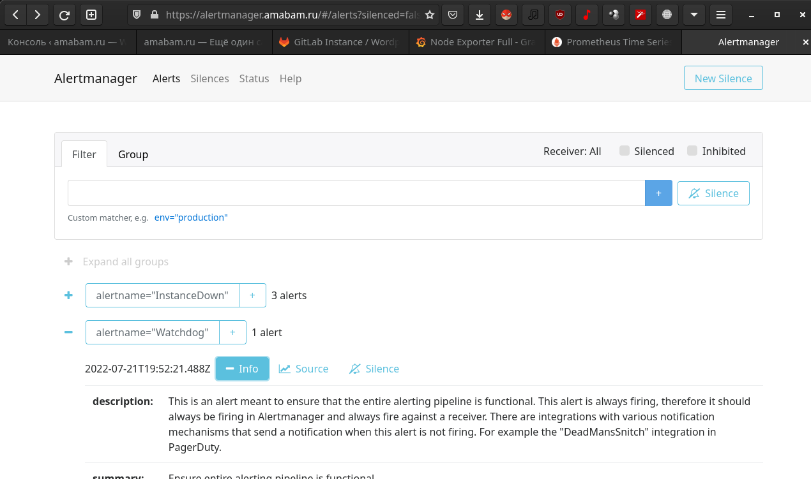
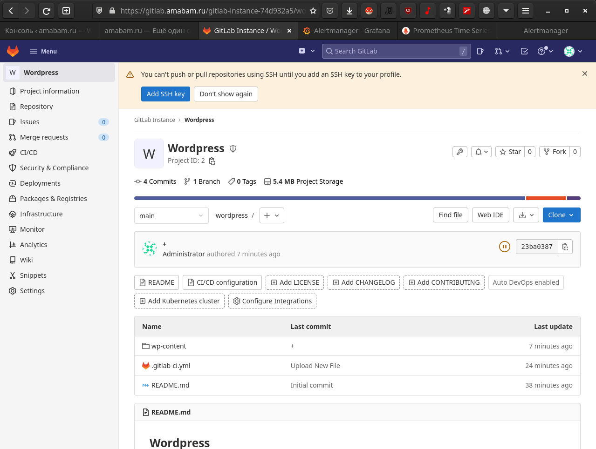
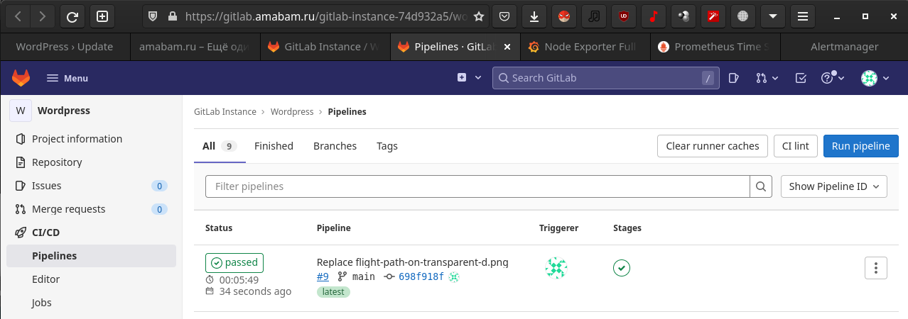
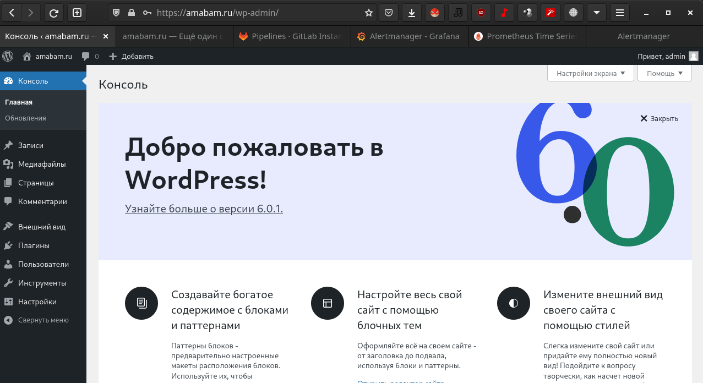
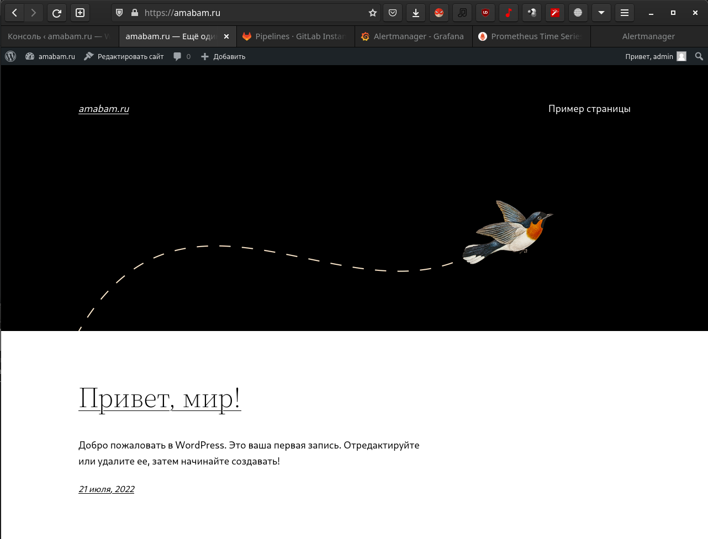
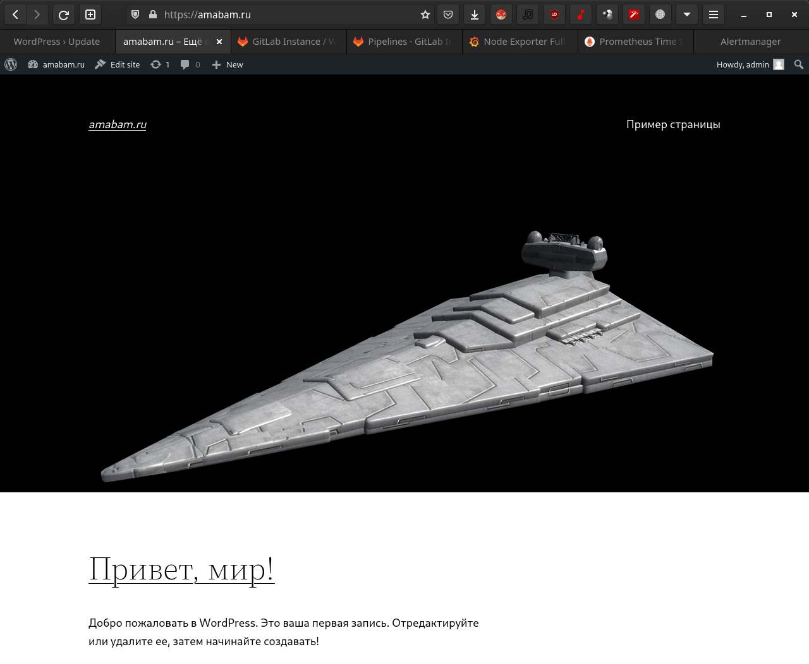

# Дипломное задание по курсу «DevOps-инженер»

## Что необходимо для использования
1. Оплаченный аккаунт в Яндекс облаке
2. Купленный и сделегированный домен
3. Установленный и настроенный terraform и ansible

## Terraform
Готовит инфраструктуру в [Yandex.cloud](https://console.cloud.yandex.ru).  
Вся конфигурация расположена в [./terraform](./terraform).  
Для корректной работы необходимо выбрать один из workspace:  
```bash
terraform workspace list
  default
  prod
* stage
```

При запуске `terraform apply`.  
Cоздаются записи в зоне amabam.ru (сделегирована на NS yandex):  
 - dns.tf
Создаются сети/подсети:
 - network.tf
ВМ создаются набором скриптов:  
 - proxy.tf - прокси на nginx
 - app.tf - wordpress
 - git.tf - gitlab
 - monitoring.tf - стек мониторинга
 - mysql.tf - БД
Настойки провайдера и некоторые переменные вынесены в:  
 - provider.tf
 - variables.tf
Блок настроек и вызов ansible:  
 - ansible.tf
 - inventory.tf
 - hosts.tf

## Ansible
Вся конфигурация расположена в [./ansible](./ansible).  
[./ansible/play.yml](./ansible/play.yml) применится на [./ansible/inventory.yml](./ansible/inventory.yml), ранее сгенерированный Terraform.

## Gitlab CI/CD
Для автоматизации доставки изменений на Worpress составлены настройки pipeline в Gitlab.  
Описание дано в [./git-conf/](./git-conf/)

## Скриншоты систем
### Мониторинг
  
  
  
### Gitlab
  
  
### Wordpress (до и после отработки pipeline)
  
  
  

_Студент: Дмитрий Ю._
