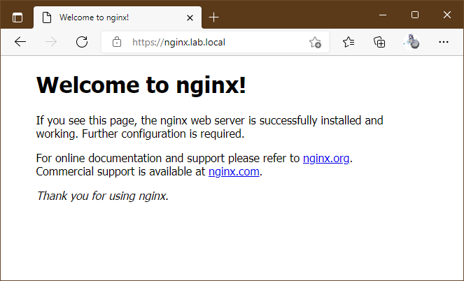
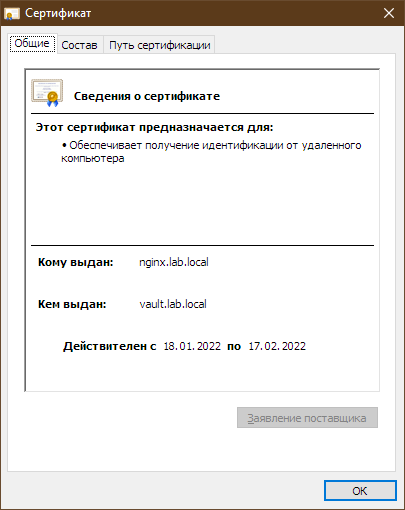
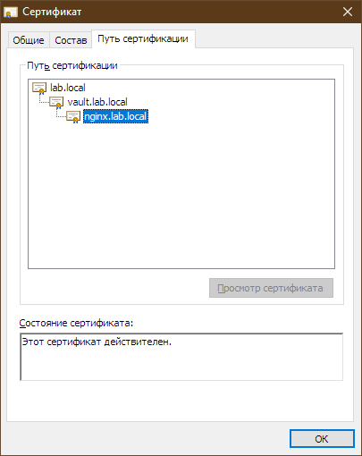
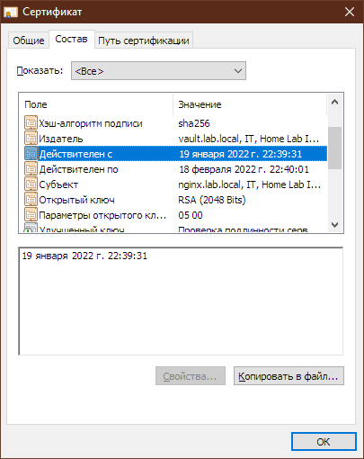
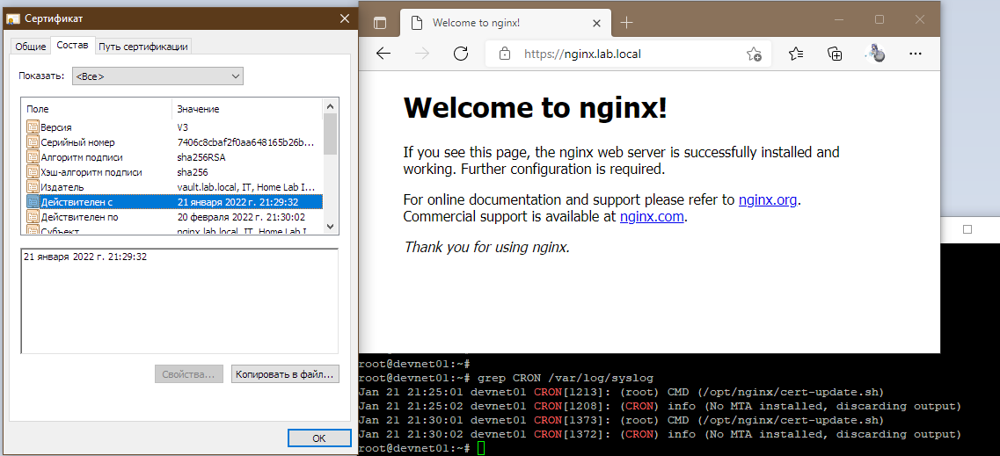

# Курсовая работа по итогам модуля "DevOps и системное администрирование"
1. Создайте виртуальную машину Linux.

Ответ: [Vagrantfile](./Vagrantfile)

2. Установите ufw и разрешите к этой машине сессии на порты 22 и 443, при этом трафик на интерфейсе localhost (lo) должен ходить свободно на все порты.

Устанавливать не пришлось - использовал в качестве box'а уже ранее загруженый bento/ubuntu, в нём из коробки.  
Порядок конфигурации (сократил вывод команды):  
```bash
root@devnet01:~# ufw default deny incoming
root@devnet01:~# ufw default allow outgoing
root@devnet01:~# ufw allow in on eth1 to any port 22
root@devnet01:~# ufw allow in on eth1 to any port 443
root@devnet01:~# ufw allow in on lo
root@devnet01:~# ufw enable
root@devnet01:~# ufw status verbose
Status: active
Logging: on (low)
Default: deny (incoming), allow (outgoing), disabled (routed)
New profiles: skip

To                         Action      From
--                         ------      ----
22 on eth1                 ALLOW IN    Anywhere
443 on eth1                ALLOW IN    Anywhere
Anywhere on lo             ALLOW IN    Anywhere
22 (v6) on eth1            ALLOW IN    Anywhere (v6)
443 (v6) on eth1           ALLOW IN    Anywhere (v6)
Anywhere (v6) on lo        ALLOW IN    Anywhere (v6)
```  
В моём случае - eth0 это внутренняя сеть VirtualBox, eth1 внешняя.

3. Установите hashicorp vault ([инструкция по ссылке](https://learn.hashicorp.com/tutorials/vault/getting-started-install?in=vault/getting-started#install-vault)).
```bash
root@devnet01:~# curl -fsSL https://apt.releases.hashicorp.com/gpg | sudo apt-key add -
root@devnet01:~# apt-add-repository "deb [arch=amd64] https://apt.releases.hashicorp.com $(lsb_release -cs) main"
root@devnet01:~# apt-get update && sudo apt-get install vault
```

4. Cоздайте центр сертификации по инструкции ([ссылка](https://learn.hashicorp.com/tutorials/vault/pki-engine?in=vault/secrets-management)) и выпустите сертификат для использования его в настройке веб-сервера nginx (срок жизни сертификата - месяц).

Ответ: [pcs_hw_4-vault.md](./pcs_hw_4-vault.md)

5. Установите корневой сертификат созданного центра сертификации в доверенные в хостовой системе.

Из-за того, что хост под управлением Windows пришлось сконвертировать полученный на предыдущем шаге сертификат:
`vagrant@devnet01:~$ openssl x509 -outform der -in lab.local_rootCA.pem -out lab.local_rootCA.crt`

6. Установите nginx.

`vagrant@devnet01:~$ sudo apt install nginx`

7. По инструкции ([ссылка](https://nginx.org/en/docs/http/configuring_https_servers.html)) настройте nginx на https, используя ранее подготовленный сертификат:
  - можно использовать стандартную стартовую страницу nginx для демонстрации работы сервера;
  - можно использовать и другой html файл, сделанный вами;

Ответ: [pcs_hw_7-nginx.md](./pcs_hw_7-nginx.md)

8. Откройте в браузере на хосте https адрес страницы, которую обслуживает сервер nginx.

  



9. Создайте скрипт, который будет генерировать новый сертификат в vault:
  - генерируем новый сертификат так, чтобы не переписывать конфиг nginx;
  - перезапускаем nginx для применения нового сертификата.

```bash
#!/usr/bin/env bash
WORK_DIR=/opt/nginx
cd $WORK_DIR
VAULT_ADDR=http://localhost:8201
TOKEN=$(cat ./t)

vault login token=$TOKEN
vault write -format=json pki_int_ca/issue/lab-dot-local-server common_name="nginx.lab.local" alt_names="nginx.lab.lo>

cat ./nginx.lab.local.crt | jq -r .data.certificate > ./nginx.lab.local.pem
cat ./nginx.lab.local.crt | jq -r .data.issuing_ca >> ./nginx.lab.local.pem
cat ./lab.local_rootCA.pem >> ./nginx.lab.local.pem
cat ./nginx.lab.local.crt | jq -r .data.private_key > ./nginx.lab.local.key

cp ./nginx.lab.local.pem /etc/ssl/certs/
cp ./nginx.lab.local.key /etc/ssl/private/

systemctl restart nginx

rm -f ./*.{crt,pem,key}
```

10. Поместите скрипт в crontab, чтобы сертификат обновлялся какого-то числа каждого месяца в удобное для вас время.

На время теста ставил генерацию каждые 5 мин для проверки:
```bash
root@devnet01:/opt/nginx# crontab -l
0 0 1 * * /opt/nginx/cert-update.sh
#*/5 * * * * /opt/nginx/cert-update.sh
```
Скриншоты (снова переключил на 5-минутную работу cron):  
  
